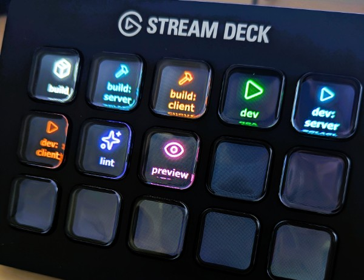
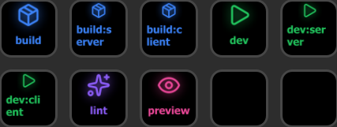
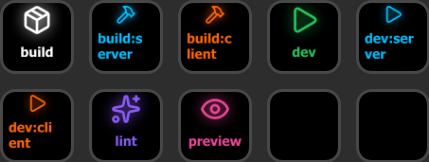
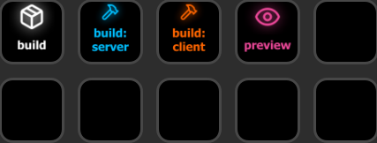

# NPM Scripts Deck

A VSCode extension that flexibly integrates npm scripts with Stream Deck for execution. Buttons are automatically placed on a dedicated profile without manual configuration.

Useful for running multiple long-running scripts simultaneously or for lengthy script names that are hard to autocomplete.
Even without a physical Stream Deck device, you can use [Virtual Stream Deck](https://www.elgato.com/us/en/s/virtual-stream-deck) for convenient access on your PC.

<p align="center">
  
</p>


> This extension requires the Stream Deck plugin [VSCode Runner](https://github.com/ugaya40/vscode-deck/tree/main/packages/vscode-runner). It also requires another VSCode extension [Stream Deck Integration](https://marketplace.visualstudio.com/items?itemName=ugaya40.vscode-streamdeck-integration), which will be automatically installed as a dependency when you install this extension.

## Features
- Automatically reads npm scripts from package.json, tracks changes, and displays/runs them on Stream Deck
  - Shows running status while executing, notifies on success or failure
  - Press again while running to cancel
- Monorepo support
  - By default, displays package.json based on the active editor's file location
  - Enable/disable individual packages via **ns-deck.json**
- Automatic styling based on script names
- Customizable colors and icons via **ns-deck.json**
- Multiple Stream Deck devices support
- Multiple VSCode instances support

### ns-deck.json
Place ns-deck.json in the same directory as package.json. If at least one ns-deck.json exists in the current workspace, only the npm scripts from package.json files in directories containing ns-deck.json will be enabled on Stream Deck.

The file can be empty, but you can customize the Stream Deck display by adding the following configuration:

```json
{
  "separator": ":",
  "scripts": ["dev", "build", "test"],
  "styles": [
    {
      "match": "dev",
      "textColor": "#22C55E",
    },
    {
      "match": "/test.*/",
      "textColor": "#EAB308",
      "icon": "FlaskConical"
    }
  ]
}
```

| Property | Type | Description |
|----------|------|-------------|
| `scripts` | `string[]` | Array of script names to display. Shows all scripts if omitted |
| `separator` | `string \| false` | `false` (default): wrap at 7 characters. String value: break lines at that character |
| `styles` | `object[]` | Array of style rules |

#### Style Rule

| Property | Type | Description |
|----------|------|-------------|
| `match` | `string` | Script name (exact match) or regex (`/pattern/` format) |
| `textColor` | `string` | Text color (CSS color value) |
| `icon` | `string` | [lucide](https://lucide.dev) icon name ([available icons](#available-icons)) |

- `textColor` and `icon` are applied independently. You can specify only one of them
- When multiple rules match, rules closer to the beginning of the array take priority

#### ns-deck.json Examples

package.json

```json
"scripts": {
  "build": "...",
  "build:server": "...",
  "build:client": "...",
  "dev": "...",
  "dev:server": "...",
  "dev:client": "...",
  "lint": "...",
  "preview": "..."
}
```

default (no ns-deck.json configuration)

<p align="center">
  
</p>

ns-deck.json:1
```json
{
  "styles": [
    { "match": "build", "icon": "Package", "textColor": "#ffffff" },
    { "match": "/build/", "icon": "Hammer" },
    { "match": "/server/", "textColor": "#00bfff" },
    { "match": "/client/", "textColor": "#ff6600" }
  ]
}
```

<p align="center">
  
</p>

ns-deck.json:2
```json
{
  "separator": ":",
  "scripts": ["build", "build:server", "build:client", "preview"],
  "styles": [
    { "match": "build", "icon": "Package", "textColor": "#ffffff" },
    { "match": "/build/", "icon": "Hammer" },
    { "match": "/server/", "textColor": "#00bfff" },
    { "match": "/client/", "textColor": "#ff6600" }
  ]
}
```

<p align="center">
  
</p>


#### Available Icons

The following [lucide](https://lucide.dev/) icons are available. Hover to see the icon name for ns-deck.json configuration.

<div style="background-color: #f5f5f5; padding: 8px; border-radius: 8px; display: inline-block;">
  
  
  
  
  
  
  
  
  
  
  
  
  
  
  
  
  
  
  
  
  
  
  
  
  
  
  
  
  
  
  
  
  
  
  
  
  
</div>

<details>
<summary>Icon name list (text for copy)</summary>

`Play`, `Package`, `Sparkles`, `FlaskConical`, `FileCheck`, `Eye`, `Rocket`, `Trash2`, `Wand2`, `DatabaseZap`, `Terminal`, `Bug`, `Download`, `Upload`, `RefreshCw`, `Hammer`, `Copy`, `Server`, `Check`, `Zap`, `Clock`, `Lock`, `Book`, `GitBranch`, `GitCommit`, `GitMerge`, `FolderOpen`, `Send`, `Archive`, `Container`, `Square`, `ScrollText`, `Search`, `Globe`, `Wifi`, `Settings`, `Code`

</details>

## Provider ID for Stream Deck Integration

Stream Deck Integration supports multiple providers, including NPM Scripts Deck. Use `npm-scripts` as the provider ID in VSCode settings when controlling display order or other settings alongside other providers:

```json
{
  "streamdeck.providers": {
    "npm-scripts": {
      "enabled": true,
      "maxSlots": 6,
      "order": 1
    }
  }
}
```
