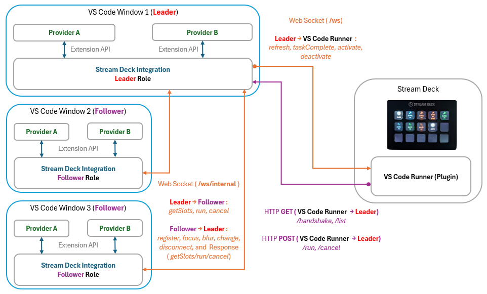

# Stream Deck Integration

Stream Deck Integration is a host VSCode extension that aggregates button information from multiple compatible providers, sends it to Stream Deck, and mediates command execution requests from Stream Deck.

**This extension does not function on its own.** It requires the Stream Deck plugin [VSCode Runner](https://github.com/ugaya40/vscode-deck/tree/main/packages/vscode-runner) and at least one compatible provider extension (e.g., [Npm Scripts Deck](https://marketplace.visualstudio.com/items?itemName=ugaya40.npm-scripts-deck)) to be installed.

<p align="center">
  
</p>

It supports multiple VSCode instances, multiple providers, and multiple Stream Deck devices, coordinating them via HTTP and WebSocket communication. This allows [custom provider development](custom-provider-guide.md) to focus solely on writing code that sends information from VSCode to Stream Deck.

## Settings

### streamdeck.port

The port number used for communication with the Stream Deck plugin. Default is `52375`.

When changing this, make sure to [set the same port](../vscode-runner/README.md#port-configuration) in the VSCode Runner plugin on the Stream Deck side. Window reload is required after changing the port.

```json
{
  "streamdeck.port": 52375
}
```

### streamdeck.providers

Configure display settings for each provider.

| Property | Type | Description |
|----------|------|-------------|
| `enabled` | `boolean` | Enable/disable the provider (default: `true`) |
| `maxSlots` | `number` | Maximum number of slots to display |
| `order` | `number` | Display order (lower values appear first) |

```json
{
  "streamdeck.providers": {
    "npm-scripts": {
      "enabled": true,
      "maxSlots": 8,
      "order": 1
    },
    "other-provider": {
      "enabled": false
    }
  }
}
```

When using multiple providers, use `order` to control display order. Set `maxSlots` to limit the number of buttons a provider can use.

## Architecture

Understanding the architecture is not actually required for implementing custom providers. However, it is documented here for troubleshooting purposes.

The most important aspects of Stream Deck Integration's architecture are **communication between Leader and Follower** and **communication between Leader and VSCode Runner**.

Both communications are based on the premise that a VSCode instance called the `Leader` is listening for connections at 127.0.0.1 on the configured port number.

<p align="center">
  
</p>

### Leader and Follower
Stream Deck Integration has **Leader Role** and **Follower Role**. The VSCode instance that becomes the `Leader` communicates with VSCode Runner (the Stream Deck plugin) on behalf of all VSCode instances.

Typically, the first VSCode instance to start becomes the `Leader`. Instances started later become `Followers` and communicate with VSCode Runner through the `Leader` instance.

#### Leader Election Mechanism
The first VSCode instance to start initially attempts to connect to a `Leader` as a `Follower` via WebSocket. Since no other VSCode instance exists, this communication naturally fails, and this instance is promoted to `Leader`. The `Leader` starts an HTTP server and waits for later VSCode instances to connect as `Followers`.

#### When Leader Instance Closes
When the `Leader` instance is closed, connected `Followers` detect the disconnection. Each `Follower` attempts to become the `Leader` with a random delay within 500ms.

- If promotion to `Leader` succeeds, that `Follower` becomes the new `Leader`. It immediately starts an HTTP server and waits for `Follower` connections.

- If another `Follower` has already become the `Leader`, promotion fails because the port is occupied. In that case, it assumes another `Leader` exists and attempts to connect as a `Follower`.

This process repeats with delays until one succeeds. This mechanism ensures a `Leader` always exists.

#### Leader-Follower Communication List

Communication occurs via WebSocket (`/ws/internal`).

**Leader → Follower:**

| Message | Description |
|---------|-------------|
| `getSlots` | Request slot list |
| `run` | Request script execution |
| `cancel` | Request execution cancellation |

**Follower → Leader:**

| Message | Description |
|---------|-------------|
| `register` | Register as Follower |
| `focus` | Window gained focus |
| `blur` | Window lost focus |
| `change` | Slot content changed |
| `disconnect` | Disconnection notification |
| `slotsResponse` | Response to `getSlots` |
| `runResponse` | Response to `run` |
| `cancelResponse` | Response to `cancel` |
| `taskCompleteForward` | Forward task completion to Stream Deck via Leader |

### Leader and VSCode Runner Communication
When VSCode Runner (the Stream Deck plugin) starts, it first attempts to connect to the `Leader`. Even if the connection fails, it continues to retry connecting to the `Leader` with a fixed delay.

#### Button Display
VSCode Runner first calls `GET /list` once when establishing connection with the `Leader` to retrieve the list of buttons to display. Upon receiving the button list, VSCode Runner virtually renders dynamic buttons within a dedicated page of a Stream Deck profile and displays them.

Subsequently, it calls `GET /list` to update the button display whenever it receives a `refresh` message via WebSocket from the `Leader`. `GET /list` is also called when [receiving command execution results](#task-execution-and-status).

The result of `GET /list` is an aggregation of buttons that the `Leader` has collected from the currently active VSCode instance.

#### activate/deactivate
Buttons are displayed on Stream Deck only when a VSCode instance is active and that active instance has buttons to display. If there are no buttons to display, Stream Deck returns from the dedicated profile to the previous profile (typically the default profile).

Whether there are buttons to display is notified via `activate`/`deactivate` messages over WebSocket from the `Leader`.

#### Task Execution and Status
When a rendered button is pressed on the Stream Deck device, `POST /run` is called. Upon receiving the `POST /run` request, the `Leader` executes the target command on the appropriate Leader/Follower.

Tasks have the concept of long-running tasks and short-running tasks.

- **Long-running tasks** are commands that use VSCode's task concept. The `POST /run` result returns success immediately if the invocation succeeds. The button then shows a running state, and the result is notified via `taskComplete` message. Task success, failure, or cancellation is notified via `taskComplete` message over WebSocket from the `Leader`. When VSCode Runner receives `taskComplete`, it renders visual feedback on the target button indicating success, failure, or cancellation for a short period (about 2 seconds).
Build commands and similar should all be implemented as long-running tasks.

- **Short-running tasks** are commands expected to complete instantly. When `POST /run` is called, it waits for the command to complete and returns the result immediately. Running state and success/failure visual feedback are still provided. VSCode shortcuts and similar commands are better suited as short-running tasks.

Both can be easily implemented when developing custom providers.

#### Leader-VSCode Runner Communication List

**HTTP (VSCode Runner → Leader):**

| Endpoint | Description |
|----------|-------------|
| `GET /handshake` | Obtain token (on initial connection) |
| `GET /list` | Retrieve slot list |
| `POST /run` | Execute command |
| `POST /cancel` | Cancel execution |

**WebSocket `/ws` (Leader → VSCode Runner):**

| Message | Description |
|---------|-------------|
| `refresh` | Instruct to re-fetch buttons |
| `taskComplete` | Task completion notification (result: success/error/canceled) |
| `activate` | Instruct to switch to dedicated profile |
| `deactivate` | Instruct to switch to default profile |
