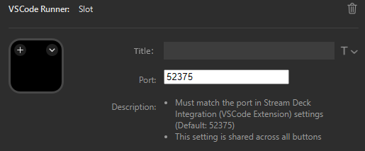

# VSCode Runner
Display and execute button information dynamically provided from VSCode on your Stream Deck.

> **Important**: This plugin is pending Elgato Marketplace review. Due to current issues with Elgato's developer portal, approval may take a while. In the meantime, download the latest `.streamDeckPlugin` file from [GitHub Releases](https://github.com/ugaya40/vscode-deck/releases) and double-click to install.

This plugin operates based on button information provided by the VSCode extension [Stream Deck Integration](https://marketplace.visualstudio.com/items?itemName=ugaya40.vscode-streamdeck-integration).

**This plugin does not function on its own.** Install the VSCode extension [Stream Deck Integration](https://marketplace.visualstudio.com/items?itemName=ugaya40.vscode-streamdeck-integration) along with a compatible provider extension (e.g., [Npm Scripts Deck](https://marketplace.visualstudio.com/items?itemName=ugaya40.npm-scripts-deck)) to use this plugin.
(Installing only the provider extension will automatically install Stream Deck Integration as a dependency.)

<p align="center">
  
</p>

Stream Deck does not natively support dynamic button addition. This plugin achieves dynamic buttons by occupying a dedicated page within a profile.

Multiple provider extensions can be used simultaneously. Each provider's buttons are displayed together on your Stream Deck.

## Port Configuration

The Stream Deck plugin and Stream Deck Integration communicate via WebSocket. The default port is `52375`.

To change the port, set the same value in both locations:

**Stream Deck side:**
Specify the port number in the VSCode Runner Slot action settings. (The value is shared across all buttons.)

<p align="center">
  
</p>

**VSCode side:**
Set `streamdeck.port` in settings.json or Stream Deck Integration's global settings:
```json
{
  "streamdeck.port": 52375
}
```
* Window reload is required after changing the port on the VSCode side.
